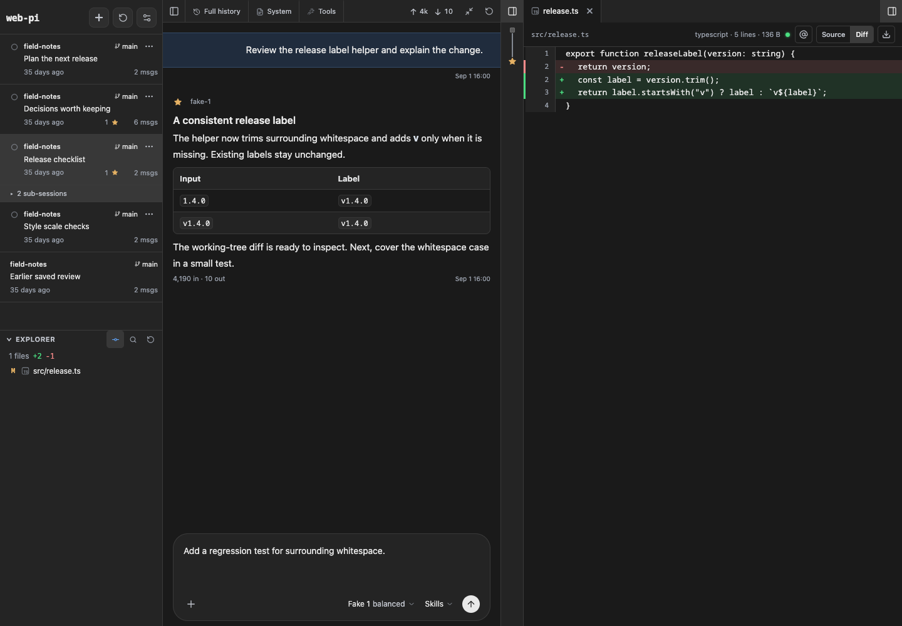
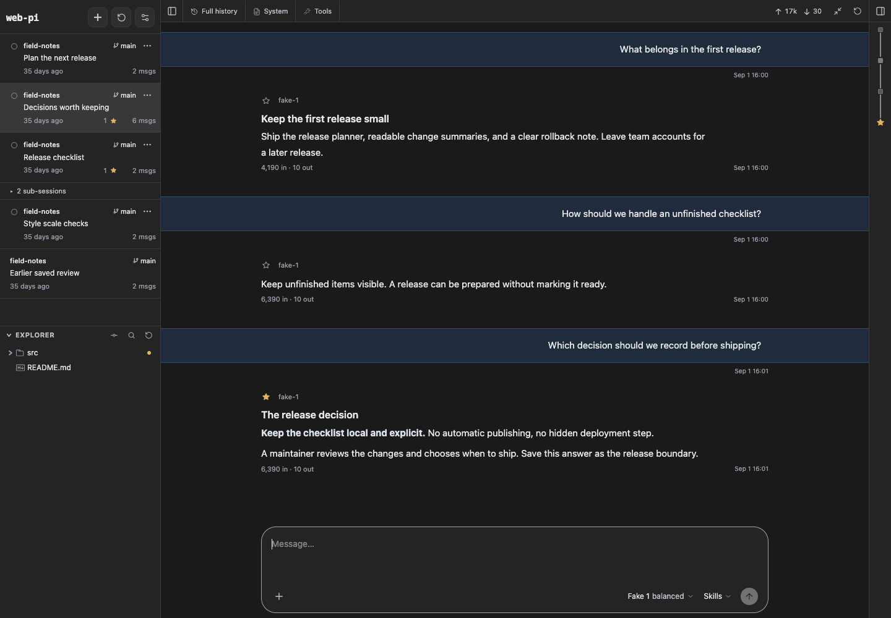
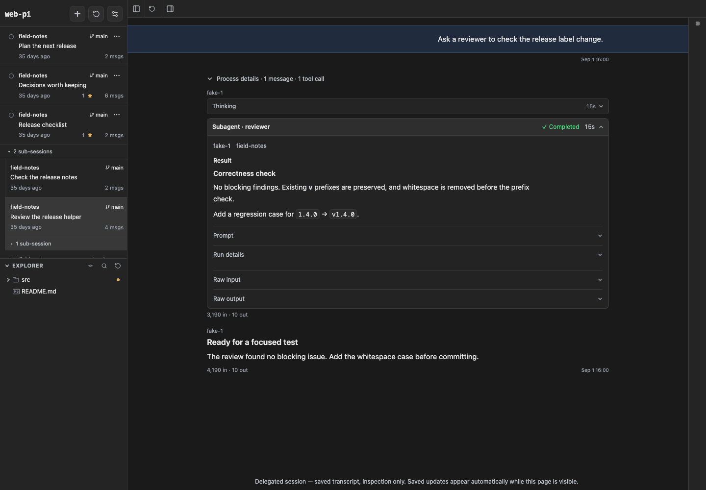
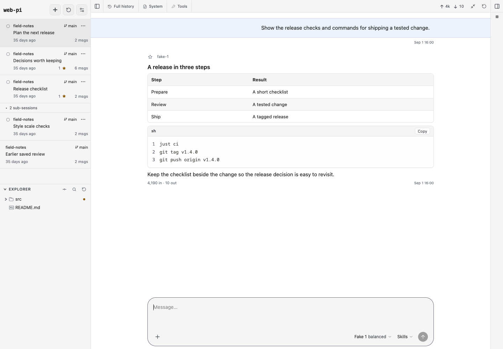
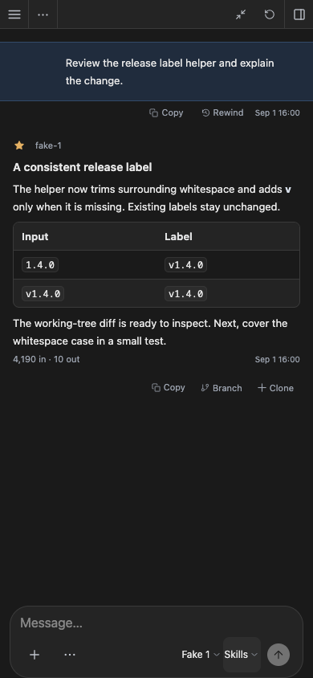

# web-pi

**Your Pi conversations, project files, and changes in one workspace.**

Read an answer, review its diff, and write the next request with both still in
view. web-pi gives the [Pi coding agent](https://github.com/earendil-works/pi) a
server-rendered browser interface built with Hono, Hono JSX, and HTMX.

It reads the session files Pi already keeps under `~/.pi/agent` and runs live
turns in-process through Pi's SDK. History stays with Pi. Pages and fragments
come from the server, with SSE updates while a turn runs; the browser keeps no
second conversation model. Drafts and navigation stay local; General's theme,
context-warning threshold and completion sound are shared across browsers.

[Install and run](#install-and-run) ·
[Explore the interface](#explore-the-interface) ·
[Migration and deployment](docs/deployment.md)



_All screenshots show this Hono interface with fictional sessions and a
temporary example project. [Reproduce them](docs/screenshots.md) from a
checkout._

## Explore the interface

### Find the answer you wanted to keep

Star a decision, explanation, or result. Sidebar counts show which sessions have
stars; the desktop conversation rail takes you to prompts and starred answers.
Hover over a prompt mark to preview it before jumping, including prompts in
history that has not loaded yet. Stars are saved in the Pi session, and the
session menu can clear them all.

The naming cutover does not read old `pi-web:star` metadata, so those answers
must be starred again. See
[the clean-cut naming change](docs/deployment.md#clean-cut-naming).



### Read the result, then inspect the process

Keep process details collapsed while reading the answer. Expand reasoning, tool
calls, command output, or a subagent result when you need the evidence. Subagent
results include separate prompt, run-details, and raw-output disclosures.
Subagent tools and orchestration come from your installed Pi extensions.



### Discuss a plan in more than plain text

Read formatted tables and highlighted code alongside the answer. Mermaid blocks
switch between source and diagram preview. Choose light, dark, or system
appearance in Settings.



### Keep working on a smaller screen

The mobile layout gives the conversation the screen. Open the sidebar and file
panel when you need them. The composer keeps model and reasoning controls close
to the request. An installable PWA supplies a separate app window, but live
sessions still need a connection to the host.



_This is browser emulation, not a physical-device test. Read
[Security](#security) before making the server reachable from another device._

## What you can do

- Browse all Pi sessions in one paginated list, with folder labels and live
  activity. Activate, stop, rename, export, fork, clone, delete, rewind, or
  navigate branches within a session.
- Choose a model and reasoning level, attach images, use slash commands, compact
  context, steer running work, or queue a follow-up.
- Inspect token usage, context, active time, and estimated streaming tokens and
  tokens per second. History pages backwards; tool results load when opened.
- Browse project files, preview source and document formats, inspect Git diffs,
  and insert file or line references into the composer.
- Open New Session directly in the composer and choose its working directory
  before sending. The choice is remembered independently of old sessions.
  Sessions remain readable when their folder disappears. See
  [Worktrees](docs/worktrees.md).
- Manage Pi skills and plugin packages globally or for a trusted project.
  Receive completion notifications and extension input requests in the browser.

web-pi does not manage Git worktrees or branches, configure provider accounts,
add a separate subagent runtime, or update itself through the browser. Configure
providers in the Pi terminal. The SDK resolves credentials for live sessions;
web-pi has no credential-management page.

This repository now contains the Hono implementation. The previous Next.js
application, its documentation, and its history remain at
[`archive/nextjs-final`](https://github.com/mjakl/web-pi/tree/archive/nextjs-final).
The import preserves both Git histories, including web-pi's performance work.

This implementation reuses the visual design and applicable behavior of that
Next.js application, a fork of [agegr/pi-web](https://github.com/agegr/pi-web).
It is not a promise of complete feature or API parity.
[Behavior and limitations](docs/behavior.md) describes what is retained and what
remains unfinished.

## Install and run

Use **Node 24 or newer**, with a separately installed `pi` on `PATH`. Host Pi
executable discovery is POSIX-only; Windows is not currently supported.
Configure a model provider in the Pi terminal before starting real turns.

web-pi links the host installation's `pi-coding-agent`, `pi-ai`,
`pi-agent-core`, and `pi-tui` packages rather than installing a pinned SDK. A
generic version-manager shim that is not inside Pi's package is rejected; use
the manager's active tool PATH. web-pi does not require `pi-server`.

web-pi is not on npm. From a checkout, install the development tools and build a
tarball:

```bash
mise install
pnpm install --frozen-lockfile   # pnpm 12.3.4; needs pi on PATH
just doctor                    # reports the resolved Pi installation
just build
pnpm pack                      # web-pi-0.1.0.tgz
npm install -g ./web-pi-0.1.0.tgz
web-pi                         # http://127.0.0.1:30142
```

The installed bin relinks the SDK on startup. Keep its installation directory
writable; after upgrading Pi, restart web-pi. Documentation and screenshots ship
inside the tarball so these relative links also work in an installed package.

| Flag               | Default                       |
| ------------------ | ----------------------------- |
| `--host <name>`    | `127.0.0.1`, or `WEB_PI_HOST` |
| `--port <number>`  | `30142`, or `WEB_PI_PORT`     |
| `--lan`            | bind `0.0.0.0`; read Security |
| `--runtime <name>` | `pi`, or `fake` for a demo    |
| `--help`           | show flags                    |
| `--version`        | show web-pi and Pi versions   |

Environment: `WEB_PI_HOST`, `WEB_PI_PORT`, `WEB_PI_RUNTIME`,
`WEB_PI_DEFAULT_CWD` (home by default), and `PI_CODING_AGENT_DIR` (defaults to
Pi's agent directory). Server-side HTTP honors `HTTP_PROXY`, `HTTPS_PROXY`, and
`NO_PROXY`.

Browser baseline: **Chrome/Edge 125+, Firefox 147+, Safari 26+**. Native
popovers, CSS anchor positioning, `@starting-style`, `:has()`, and
`field-sizing` are required, not optional enhancements. These are the declared
support floors, not a claim that every minimum browser was exercised for this
change.

## Settings and notifications

**Settings → General** holds shared appearance (default **auto**), dumb-zone
warning threshold (**100000 tokens**), and completion sound (**on**). Auto
follows each device's OS appearance. These settings, push state and remembered
worktree mappings live under `<agentDir>/web-pi/`, separate from Pi's own
configuration. Existing browser preferences are deliberately reset, not
imported.

Subscribe or unsubscribe **this browser** in General. Push requires HTTPS (or
localhost) and browser push support; iPhone/iPad users must open a Home Screen
web app, not a normal browser tab. Permission alone does not enroll a browser,
and nothing subscribes automatically. Notifications cover completed runs in this
web server, not terminal Pi, and OS delivery is not guaranteed.

Before an upgrade or reset, read
[web-state cutover and reset](docs/deployment.md#web-state-cutover-and-reset).
Stop affected old web runtimes for the one-time file migration. With the server
stopped after cutover, deleting only `<agentDir>/web-pi/` resets web state
without touching Pi data. Browsers then need to confirm enrollment again.

## Conversational coordinator prototype

Open **Coordinator** to talk about tasks across sessions, independently of the
coding session on screen. **Start voice** starts the conversation and requests
microphone consent in one action. **End** stops both. Nothing listens or speaks
automatically on page load. **Text fallback and voice details** contains **Start
text only**, an editable draft, and independent playback controls.

Set `OPENAI_API_KEY` in the server's environment before startup. The key stays
server-side. This prototype uses `gpt-live-1` with client delegation and a
server-owned `gpt-4.1-mini-2025-04-14` Responses coordinator. Both requests
explicitly use `store:false`. This disables requested application-state storage,
not ordinary abuse-monitoring retention. Enabling the coordinator sends bounded
session metadata and conversation text to OpenAI. API billing is separate from
ChatGPT subscriptions: Live costs $0.05 per active minute, including silence,
plus text-model and coding usage. Missing credentials and provider failures are
reported; there is no fallback to another voice product.

- Ask to list sessions, then use their `S1`, `S2` handles or displayed short
  labels. Handles remain stable until **End**. Duplicate labels and conflicting
  targets require clarification. **Current target** is separate from the coding
  session displayed behind the panel.
- The coordinator rewrites indirect requests into direct, contextualized
  proposals. Review the target and exact instruction, then choose **Confirm and
  send this instruction**. A busy session receives ordinary requests after its
  current work; an idle session starts them immediately. Nothing is sent by the
  model alone. Acceptance means Pi admitted the prompt, not that the task
  succeeded.
- Voice captions are approximate fragments, not finalized turns. **Use captured
  words** copies a snapshot into the editable draft. **Review instruction** also
  works without a microphone. New speech invalidates a pending proposal.
- Typed extension dialogs have exact, session-bound answer controls. Spoken
  assent never approves them. Ordinary assistant questions remain prose; they
  are not automatically classified as approval dialogs.
- New assistant text in the observed root sessions is summarized briefly. Tool
  output, thinking, token deltas and historical answers are not announced.
  Saved-session file changes are observed without opening a writer; external
  activity is not inferred. Full session text remains the source of truth.
- **Stop speaking** mutes playback until **Resume speech**. **Mute microphone**,
  **Switch to text**, and **End** never cancel coding. Use the coding session's
  existing Stop control to cancel work deliberately.

The trial is bounded to one coordinator per server and 50 recent root sessions.
Backend reasoning and proactive summaries have no fixed request-count cutoff;
each request remains bounded and only one runs at a time. Their usage is billed
separately from voice. Text-only coordination ends 90 minutes after **Start text
only**. The first successful provider voice connection starts a fresh 90-minute
window for the conversation; text-only preparation does not consume that voice
window. Stopping and restarting voice does not extend it again. Browser audio
negotiation follows the provider connection. At
$0.05 per connected minute, 90 minutes costs $4.50 for voice, including silence,
plus coordinator and coding usage. It keeps only bounded in-memory coordinator
context, not another persistent coding history. It does not create sessions,
grant project trust, orchestrate worktrees or merge work. Sending requires a
runtime already activated in this server; saved or external sessions are not
silently opened. Stop an external writer before activating its session.
Coordinator work conservatively excludes concurrent work in the same project,
including sibling worktrees, through the web server's prompt and shell admission
paths. It cannot coordinate writers in another process.

Ordinary in-app navigation preserves the panel. Reload, owner removal or stream
failure ends the conversation instead of reconnecting speech or retrying work.
Read
[the isolated trial instructions](docs/deployment.md#isolated-coordinator-trial)
before trying it beside a live service. Remote microphone use requires trusted
HTTPS; plain remote HTTP is text-only. Local Stop releases microphone/playback
immediately; restarting waits for outstanding voice controls and remote cleanup.
Client cleanup failures block restart. A provider-side disconnect can leave
restart enabled despite an unconfirmed-finalization warning; choose **End**
before trying again whenever that warning appears.

Live provider operation, continuous 90-minute WebRTC use and phone/headphone use
are unverified. Backgrounding, screen lock, calls, headset changes and network
handoffs may interrupt capture or playback. No automatic reconnect or background
keepalive is provided. While unmuted, the microphone sends nearby audio even
with the panel collapsed; Stop speaking does not mute it. Coding instructions
and approval questions still require the visible confirmation controls, so this
is not a hands-free approval workflow. See the
[mobile trial checks](docs/deployment.md#phone-and-headphone-trial-limits).
Automated checks use fake transports; real account access, voice latency and
model wording quality require a separately authorized trial with credentials.

## Security

web-pi runs agent tools and project commands. It has no accounts, login, or
built-in authentication. Ordinary session routes do not check `Host` or
`Origin`; coordinator POSTs require same-host JSON and use a short-lived
conversation cookie. That guard is not application authentication. Keep it on
`127.0.0.1` unless you have a trusted network or an external access-control
layer. `--lan` prints a warning for the same reason.

Project resources can run local code. Extensions, skills, and other
trust-requiring project resources stay dormant until you trust the project.
Trust only repositories you control or have reviewed.

File-content access goes through the server's allowed-root policy. The folder
picker can list other readable directory names; selecting a folder grants access
to it for the server process. This file boundary does not sandbox agent tools.
See [Behavior](docs/behavior.md) and [Deployment](docs/deployment.md), including
the restrictions on concurrent access to one session.

## Work on it

After the checkout setup above:

```bash
just dev              # http://127.0.0.1:30142, sources and asset watchers
just qa               # format/fix, lint, typecheck, tests
just ci               # non-fixing checks plus installed-package smoke
just test-one tests/web
```

`just build` writes the bundled server in `dist/` and built assets in `static/`.
Tests run against sources; `just smoke` packs the build, installs it into a
throwaway consumer, and serves a fictional session from the installed bin. After
upgrading Pi, `just link-pi` or a recipe that runs code refreshes the links.

Contributor guidance lives in `AGENTS.md` in the checkout, with `CLAUDE.md` as
its symlink. Framework-independent workflows live in `.agents/skills`, with
compatibility links under `.claude/skills`. See
[Architecture](docs/architecture.md) for ownership and
[Screenshots](docs/screenshots.md) for the capture fixture.

## License

[MIT](LICENSE), copyright Michael Jakl. Copied pi-web CSS, code, and adapted
supporting material retain [pi-web's MIT notice](LICENSE.pi-web), copyright
agegr. Preserved workflow skills carry their own licenses and provenance.
